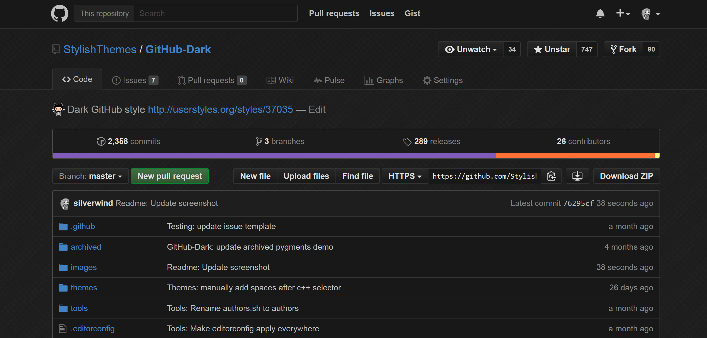

  
   
  
  
  
  
  

<h2 align="center">Your eyes will&nbsp;:heart:&nbsp;you.</h2>

## Preview

## Installation

Install [Stylus](https://add0n.com/stylus.html) for either [Firefox](https://addons.mozilla.org/en-US/firefox/addon/styl-us/), [Chrome](https://chrome.google.com/webstore/detail/stylus/clngdbkpkpeebahjckkjfobafhncgmne) or [Opera](https://addons.opera.com/en-gb/extensions/details/stylus/) or [Cascadea for Safari](https://cascadea.app/) and then install using one of these methods:

📦 [Install the usercss](https://raw.githubusercontent.com/StylishThemes/GitHub-Dark/master/github-dark.user.css) which supports automatic updates and customization. 
📦 [Install manually from GitHub](https://raw.githubusercontent.com/StylishThemes/GitHub-Dark/master/github-dark.css) with no customization, but useful for development. The style is in Mozilla format. 

## Additional Userstyles

⚙️ [GitHub Blog Dark](https://github.com/StylishThemes/GitHub-Blog-Dark) 
⚙️ [GitHub Code Wrap](https://github.com/StylishThemes/GitHub-code-wrap) 
⚙️ [GitHub Commit Limit](https://github.com/StylishThemes/GitHub-Commit-Limit) 
⚙️ [GitHub Community Dark](https://github.com/StylishThemes/GitHub-Community-Dark) 
⚙️ [GitHub Compact Feed](https://github.com/StylishThemes/GitHub-Compact-Feed) 
⚙️ [GitHub Dark Calendar Color Customizer](https://github.com/StylishThemes/Feature-Override-Styles) 
⚙️ [GitHub Dark Diff Color Customizer](https://github.com/StylishThemes/Feature-Override-Styles) 
⚙️ [GitHub Dark Element Borders](https://github.com/StylishThemes/Feature-Override-Styles) 
⚙️ [GitHub Dark IMG Background Color](https://raw.githubusercontent.com/StylishThemes/Feature-Override-Styles/master/github-dark-img-bg-clr.user.css) 
⚙️ [GitHub Feed Icons](https://github.com/StylishThemes/GitHub-Feed-Icons) 
⚙️ [GitHub FixedHeader](https://github.com/StylishThemes/GitHub-FixedHeader) 
⚙️ [GitHub Selected Tab Color](https://github.com/StylishThemes/GitHub-Selected-Tab-Color) 
⚙️ [GitHub Sticky Sidebar](https://github.com/StylishThemes/GitHub-Sticky-Sidebar) 
⚙️ [GitHub Tab Size](https://github.com/StylishThemes/GitHub-tab-size) 
⚙️ [GitHub Unrounded](https://github.com/StylishThemes/GitHub-Unrounded) 
⚙️ [Overlay Scrollbars](https://github.com/StylishThemes/Overlay-Scrollbars) 

## Supported GitHub Extensions

💾 [Gitako](https://github.com/EnixCoda/Gitako) 
💾 [GitHub Hovercard](https://github.com/Justineo/github-hovercard) 
💾 [GitHub Notifications Dropdown](https://openuserjs.org/scripts/joeytwiddle/Github_Notifications_Dropdown) 
💾 [GitHub Polls](https://github.com/apex/gh-polls) 
💾 [Lovely forks](https://github.com/musically-ut/lovely-forks#lovely-forks) 
💾 [npmhub](https://github.com/npmhub/npmhub) 
💾 [OctoLinker](https://github.com/OctoLinker/OctoLinker) 
💾 [Octotree](https://github.com/buunguyen/octotree/#octotree) 
💾 [Refined GitHub](https://github.com/sindresorhus/refined-github) 
💾 [ZenHub](https://www.zenhub.io/) 
💾 [Notifications Preview for GitHub](https://github.com/tanmayrajani/notifications-preview-github) 

## Available Syntax Highlighting Themes ([Demo](https://stylishthemes.github.io/GitHub-Dark/))

| Theme                      |   GitHub    |  CodeMirror  |    Jupyter   |
|----------------------------|:-----------:|:------------:|:------------:|
| Ambiance                   |      ✔️     |      ✔️     |      ❌      |
| Base16 Ocean Dark          |      ❌     |      ✔️     |      ✔️      |
| Chaos                      |      ✔️     |      ❌     |      ❌      |
| Clouds Midnight            |      ✔️     |      ❌     |      ❌      |
| Cobalt                     |      ✔️     |      ✔️     |      ❌      |
| Dracula                    |      ❌     |      ✔️     |      ✔️      |
| GitHub Dark                |      ✔️     |      ❌     |      ✔️      |
| Idle Fingers               |      ✔️     |      ❌     |      ✔️      |
| Kr Theme                   |      ✔️     |      ❌     |      ❌      |
| Material                   |   [🚧][1]   |      ✔️     |      ❌      |
| Merbivore                  |      ✔️     |      ❌     |      ❌      |
| Merbivore Soft             |      ✔️     |      ❌     |      ❌      |
| Mono Industrial            |      ✔️     |      ❌     |      ❌      |
| Mono Industrial Clear      |      ✔️     |      ❌     |      ❌      |
| Monokai                    |      ✔️     |      ✔️     |      ✔️      |
| Monokai Spacegray Eighties |      ✔️     |      ✔️     |      ✔️      |
| Obsidian                   |      ✔️     |      ❌     |      ✔️      |
| One Dark                   |      ✔️     |      ✔️     |      ❌      |
| Pastel on Dark             |      ✔️     |      ✔️     |      ✔️      |
| Railscasts                 |      ✔️     |      ✔️     |      ✔️      |
| Solarized Dark             |      ✔️     |      ✔️     |      ✔️      |
| Terminal                   |      ✔️     |      ❌     |      ❌      |
| Tomorrow Night             |      ✔️     |      ❌     |      ✔️      |
| Tomorrow Night Blue        |      ✔️     |      ❌     |      ✔️      |
| Tomorrow Night Bright      |      ✔️     |      ✔️     |      ✔️      |
| Tomorrow Night Eighties    |      ✔️     |      ✔️     |      ✔️      |
| Twilight (**default**)     |      ✔️     |      ✔️     |      ✔️      |
| Vibrant Ink                |      ✔️     |      ✔️     |      ❌      |

- Support for [Codemirror](https://codemirror.net/demo/theme.html) and [Jupyter notebook](https://github.com/sujitpal/statlearning-notebooks/blob/master/src/chapter2.ipynb) syntax highlighting themes as listed above.
- Please provide a pull request if you have or want to create a missing theme, or help complete the theme(s) designated with a construction symbol (🚧).

[1]:https://github.com/StylishThemes/GitHub-Dark/pull/568

## Notes

- If you're using a custom domain for GitHub Enterprise, be sure to include it through a `@-moz-document` rule (Firefox) or add it to the `Applies to` section in (Chrome).

## Contributions

If you would like to contribute to this repository, please...

1. 👓 Read the [contribution guidelines](./.github/CONTRIBUTING.md).
1. [ Fork](https://github.com/StylishThemes/GitHub-Dark/fork) or [ download](https://github.com/StylishThemes/GitHub-Dark/archive/master.zip) this repository.
1. 👌 Create a pull request!

## Development

First, make sure you have these installed:

- [`node`](https://nodejs.org): version 12 or greater
- [`yarn`](https://classic.yarnpkg.com/en/docs/install/): version 1
- `make`: comes with Unix-like OS, on Windows use [this](https://stackoverflow.com/a/54086635/808699)

To get started, run `make deps` after which you can use the following `make` targets:

- `make build`: Runs the `generate` and `usercss` tasks.
- `make usercss`: Build the [Usercss](https://github.com/openstyles/stylus/wiki/Usercss) style.
- `make themes`: Parse the theme files and combine them into minified styles in the `themes` directory.
- `make clean`: Reformat `github-dark.css` to conform the style guide.
- `make lint`: Run Stylelint on `github-dark.css`.
- `make authors`: Regenerate the `AUTHORS` file based on git history.
- `make generate`: Regenerate auto-generated CSS rules compiled from various public sources.
- `make patch`: Increment the patch version number, update file headers, create a commit and push it to `origin`.
- `make minor`: Increment the minor version number, update file headers, create a commit and push it to `origin`.
- `make major`: Increment the major version number, update file headers, create a commit and push it to `origin`.
- `make update`: Update and install dependencies.

Thanks to all that have [contributed](./AUTHORS) so far!

And thanks for the shoutout on the [JS Party](https://changelog.com/jsparty/20#transcript-71) podcast!
