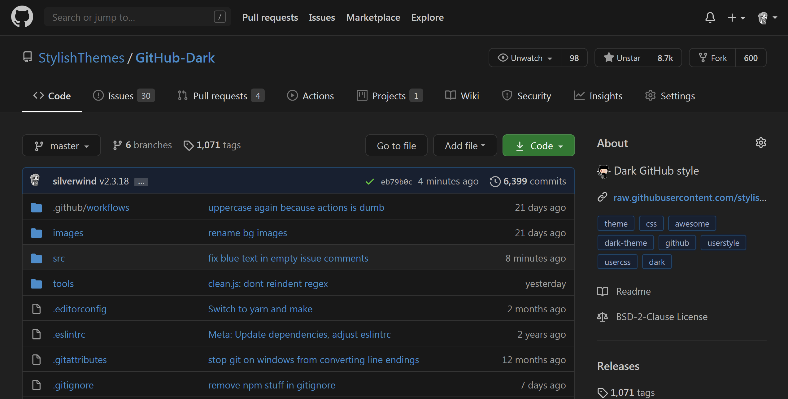

<p align="center">
  
  <br>
  <a href="https://github.com/StylishThemes/GitHub-Dark/tags">
    
  </a>
  <a href="https://github.com/StylishThemes/GitHub-Dark/stargazers">
    
  </a>
  <a href="https://github.com/StylishThemes/GitHub-Dark/network">
    
  </a>
  <a href="https://david-dm.org/StylishThemes/GitHub-Dark?type=dev">
    
  </a>
  <a href="https://gitter.im/StylishThemes/GitHub-Dark">
    
  </a>
</p>
<h2 align="center">Your eyes will&nbsp;:heart:&nbsp;you.</h2>

# TOC
  * [Preview](#preview)
  * [Installation](#installation)
    * [Additional Userstyles](#additional-userstyles)
    * [Supported GitHub Extensions](#supported-github-extensions)
    * [Available Syntax Highlighting Themes](#available-syntax-highlighting-themes-demo)
  * [Contributions and Development](#contributions-and-development)
    * [Auto generated CSS](#auto-generated-css)
    * [Manual override entries](#manual-override-entries)
    * [Make targets](#make-targets)
  * [Notes](#notes)


## Preview



## Installation

1. Install [Stylus for Firefox](https://addons.mozilla.org/en-US/firefox/addon/styl-us/), [Chrome](https://chrome.google.com/webstore/detail/stylus/clngdbkpkpeebahjckkjfobafhncgmne), [Opera](https://addons.opera.com/en-gb/extensions/details/stylus/) or [Cascadea for Safari](https://cascadea.app/).
2. Install [github-dark.user.css](https://raw.githubusercontent.com/StylishThemes/GitHub-Dark/master/github-dark.user.css).

## Additional Userstyles

⚙️ [GitHub Custom Fonts](https://raw.githubusercontent.com/StylishThemes/GitHub-Dark/master/github-custom-fonts.user.css)<br>
⚙️ [GitHub Blog Dark](https://github.com/StylishThemes/GitHub-Blog-Dark)<br>
⚙️ [GitHub Code Wrap](https://github.com/StylishThemes/GitHub-code-wrap)<br>
⚙️ [GitHub Commit Limit](https://github.com/StylishThemes/GitHub-Commit-Limit)<br>
⚙️ [GitHub Community Dark](https://github.com/StylishThemes/Discourse-Dark) - Now part of Discourse Dark<br>
⚙️ [GitHub Compact Feed](https://github.com/StylishThemes/GitHub-Compact-Feed)<br>
⚙️ [GitHub Dark Calendar Color Customizer](https://raw.githubusercontent.com/StylishThemes/Feature-Override-Styles/master/github-dark-calendar-color-customizer.user.css)<br>
⚙️ [GitHub Dark Diff Color Customizer](https://raw.githubusercontent.com/StylishThemes/Feature-Override-Styles/master/github-dark-diff-color-customizer.user.css)<br>
⚙️ [GitHub Dark Element Borders](https://raw.githubusercontent.com/StylishThemes/Feature-Override-Styles/master/github-dark-element-borders.user.css)<br>
⚙️ [GitHub Dark IMG Background Color](https://raw.githubusercontent.com/StylishThemes/Feature-Override-Styles/master/github-dark-img-bg-clr.user.css)<br>
⚙️ [GitHub Feed Icons](https://github.com/StylishThemes/GitHub-Feed-Icons)<br>
⚙️ [GitHub FixedHeader](https://github.com/StylishThemes/GitHub-FixedHeader)<br>
⚙️ [GitHub Selected Tab Color](https://github.com/StylishThemes/GitHub-Selected-Tab-Color)<br>
⚙️ [GitHub Sticky Sidebar](https://github.com/StylishThemes/GitHub-Sticky-Sidebar)<br>
⚙️ [GitHub Tab Size](https://github.com/StylishThemes/GitHub-tab-size)<br>
⚙️ [GitHub Custom Border Radii](https://github.com/StylishThemes/Feature-Override-Styles/blob/master/github-custom-border-radii.user.css)<br>
⚙️ [GitHub Dark Custom Blame usercss](https://raw.githubusercontent.com/StylishThemes/Feature-Override-Styles/master/github-dark-custom-blame.user.css)<br>
⚙️ [GitHub Upstream BugFixes usercss](https://github.com/StylishThemes/GitHub-Upstream-BugFixes/raw/master/github-upstream-bugfixes.user.css)<br>
⚙️ [Overlay Scrollbars](https://github.com/StylishThemes/Overlay-Scrollbars)<br>

## Supported GitHub Extensions

💾 [Gitako](https://github.com/EnixCoda/Gitako)<br>
💾 [GitHub Hovercard](https://github.com/Justineo/github-hovercard)<br>
💾 [GitHub Notifications Dropdown](https://openuserjs.org/scripts/joeytwiddle/Github_Notifications_Dropdown)<br>
💾 [GitHub Polls](https://github.com/apex/gh-polls)<br>
💾 [Lovely forks](https://github.com/musically-ut/lovely-forks#lovely-forks)<br>
💾 [Notifications Preview for GitHub](https://github.com/tanmayrajani/notifications-preview-github)<br>
💾 [npm-hub](https://github.com/npmhub/npmhub)<br>
💾 [OctoLinker](https://github.com/OctoLinker/OctoLinker)<br>
💾 [Octotree](https://github.com/buunguyen/octotree/#octotree)<br>
💾 [Refined GitHub](https://github.com/sindresorhus/refined-github)<br>
💾 [Sourcegraph Browser Extension](https://docs.sourcegraph.com/integration/browser_extension)<br>
💾 [ZenHub](https://www.zenhub.com/)<br>

## Available Syntax Highlighting Themes ([Demo](https://stylishthemes.github.io/GitHub-Dark/))

| Theme                      |   GitHub    |  CodeMirror  |    Jupyter   |
|----------------------------|:-----------:|:------------:|:------------:|
| Ayu Mirage                 |      ✔️     |      ❌     |      ❌      |
| Ambiance                   |      ✔️     |      ✔️     |      ❌      |
| Base16 Ocean Dark          |      ❌     |      ✔️     |      ✔️      |
| Chaos                      |      ✔️     |      ❌     |      ❌      |
| Clouds Midnight            |      ✔️     |      ❌     |      ❌      |
| Cobalt                     |      ✔️     |      ✔️     |      ❌      |
| Dracula                    |      ❌     |      ✔️     |      ✔️      |
| GitHub Dark                |      ✔️     |      ❌     |      ✔️      |
| Idle Fingers               |      ✔️     |      ❌     |      ✔️      |
| Kr Theme                   |      ✔️     |      ❌     |      ❌      |
| Material                   |   [🚧][1]   |      ✔️     |      ❌      |
| Merbivore                  |      ✔️     |      ❌     |      ❌      |
| Merbivore Soft             |      ✔️     |      ❌     |      ❌      |
| Mono Industrial            |      ✔️     |      ❌     |      ❌      |
| Mono Industrial Clear      |      ✔️     |      ❌     |      ❌      |
| Monokai                    |      ✔️     |      ✔️     |      ✔️      |
| Monokai Spacegray Eighties |      ✔️     |      ✔️     |      ✔️      |
| Obsidian                   |      ✔️     |      ❌     |      ✔️      |
| One Dark                   |      ✔️     |      ✔️     |      ❌      |
| Pastel on Dark             |      ✔️     |      ✔️     |      ✔️      |
| Railscasts                 |      ✔️     |      ✔️     |      ✔️      |
| Solarized Dark             |      ✔️     |      ✔️     |      ✔️      |
| Terminal                   |      ✔️     |      ❌     |      ❌      |
| Tomorrow Night             |      ✔️     |      ❌     |      ✔️      |
| Tomorrow Night Blue        |      ✔️     |      ❌     |      ✔️      |
| Tomorrow Night Bright      |      ✔️     |      ✔️     |      ✔️      |
| Tomorrow Night Eighties    |      ✔️     |      ✔️     |      ✔️      |
| Twilight (**default**)     |      ✔️     |      ✔️     |      ✔️      |
| Vibrant Ink                |      ✔️     |      ✔️     |      ❌      |

- Support for [Codemirror](https://codemirror.net/demo/theme.html) and [Jupyter notebook](https://github.com/sujitpal/statlearning-notebooks/blob/master/src/chapter2.ipynb) syntax highlighting themes as listed above.
- Please provide a pull request if you have or want to create a missing theme, or help complete the theme(s) designated with a construction symbol (🚧).

[1]:https://github.com/StylishThemes/GitHub-Dark/pull/568

## Contributions and Development

If you would like to contribute to this repository, please...

1. [ Fork](https://github.com/StylishThemes/GitHub-Dark/fork)
2. Make sure you have these installed:

- [`node`](https://nodejs.org): version 12 or greater
- [`yarn`](https://classic.yarnpkg.com/en/docs/install/): version 1
- `make`: available with UNIX-like OS, on Windows you can use [this](https://stackoverflow.com/a/54086635/808699)

To retrieve all GitHub styles, a login session is needed unfortunately. Create a dummy GitHub account and set the following environment variables that the build script will use to log in:

```bash
export GHD_GH_USERNAME=username
export GHD_GH_PASSWORD=password
```

Then run `make build` to rebuild the style. Any custom changes should be done in the files in the `src` directory. Do not edit the `.css` files in the project root, these are generated.

### Auto-generated CSS

Contributing e.g. unstyled items, sources, extensions, etc. to name a few.

See and edit the respective files in [/src/gen/](./src/gen/) then run `make build install` to rebuild and reinstall the style, then test your fixes and send a pull request.

### Manual override entries

Manual overrides to e.g. generated content or inline HTML styles to name a few.

See and edit respective files in [`src`](./src) then run `make build install` to rebuild and reinstall the style, then test your fixes and send a pull request.

### Make targets

- `make deps`: Install development dependencies into `Github Dark/node_modules`
- `make build`: Build `github-dark.user.css`
- `make install`: Install `github-dark.user.css`
- `make lint`: Run linters
- `make clean`: Format source files

Lesser used targets include:

- `make authors`: Regenerate the `AUTHORS` file based on git history
- `make update`: Update dependencies
- `make`: Alias for `make build`

Internal use only targets include:

- `make patch`: Increment the patch version, create a commit and push it
- `make minor`: Increment the minor version, create a commit and push it
- `make major`: Increment the major version, create a commit and push it

## Notes

- If you're using a custom domain for GitHub Enterprise, be sure to include it through a `@-moz-document` rule (Firefox) or add it to the `Applies to` section in (Chrome).

Thanks to all our [contributors](./AUTHORS) so far! And thanks for the shoutout on the [JS Party](https://changelog.com/jsparty/20#transcript-71) podcast!

[⬆️ UP](#toc)
